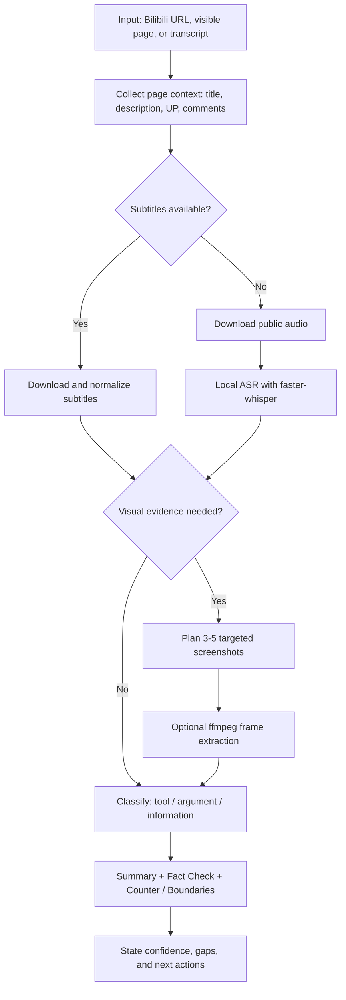

# BiliBili Sub Summary

> 中文：面向人类和 Agent 的 B 站视频字幕、ASR、截图证据和结构化总结工作流。
> English: A human- and agent-readable workflow for Bilibili subtitles, ASR fallback, visual evidence, and structured video summaries.

## What This Is / 这是什么

中文：

这个项目把“给一个 B站视频链接 -> 获取字幕或转写 -> 必要时补关键截图 -> 输出总结/事实核查/反方观点”封装成可复用的 agent skill 和本地脚本。它尤其适合：

- 工具教程：整理步骤、前置条件、坑点和排错路径。
- 观点视频：用 SFC（Summary / Fact Check / Counter）做总结、事实核查和反方观点。
- 信息视频：整理关键信息、时间线、行动清单和不确定性。
- 视觉依赖视频：用少量关键截图补足字幕/ASR 看不到的图表、地图、UI、代码、排行榜、参数、路线等信息。

English:

This repository packages a reusable agent skill and local helper scripts for the workflow: Bilibili URL -> subtitles or ASR transcript -> targeted screenshots when needed -> structured summary, fact check, and counter-analysis. It is designed for:

- Tool/tutorial videos: steps, prerequisites, failure points, troubleshooting.
- Argument videos: SFC summary, fact checking, counter-arguments, boundaries.
- Informational videos: facts, timelines, action lists, uncertainty.
- Visually dependent videos: low-cost screenshots for charts, maps, UI, code, rankings, parameters, routes, and other screen-only evidence.

## Workflow / 工作流图示



## Quick Install For Agents / Agent 一键安装

### Codex / OpenAI Codex Desktop

Windows PowerShell:

```powershell
git clone https://github.com/intKay/BiliBili-Sub-Summary.git
cd BiliBili-Sub-Summary
powershell -NoProfile -ExecutionPolicy Bypass -File .\install_skill.ps1
```

Fedora / Linux / WSL / macOS:

```bash
git clone https://github.com/intKay/BiliBili-Sub-Summary.git
cd BiliBili-Sub-Summary
chmod +x ./install_skill.sh
./install_skill.sh
```

Default install path / 默认安装位置：

- Windows: `$HOME\.codex\skills\bilibili-video-analysis`
- Linux / macOS / WSL: `$HOME/.codex/skills/bilibili-video-analysis`
- With `CODEX_HOME`: `$CODEX_HOME/skills/bilibili-video-analysis`

After installation, start a new agent session and ask:

```text
Use the bilibili-video-analysis skill to analyze this Bilibili video: <URL>
```

### OpenCode / Hermes / Claude Code / Gemini CLI / Cursor / Windsurf / Cline / Roo / Aider / Continue / Generic Agents

If the target agent does not auto-discover Codex skills:

1. Open [`skills/bilibili-video-analysis/PORTABLE_AGENT_PROMPT.md`](skills/bilibili-video-analysis/PORTABLE_AGENT_PROMPT.md).
2. Copy the full prompt inside the code block into the agent's system prompt, project instructions, repository instructions, memory, rules, or custom instructions.
3. Expose this repository's `scripts/` directory as optional tools when the agent can run shell commands.
4. Tell the agent not to save cookies, SESSDATA, browser profiles, full logged-in HTML, or private account state.

Copy-paste starter instruction:

```text
Use the Bilibili video analysis workflow from skills/bilibili-video-analysis/PORTABLE_AGENT_PROMPT.md.
Use scripts/ helpers when available.
Do not save cookies, SESSDATA, browser profiles, full logged-in HTML, or private account state.
Prefer subtitles, then ASR, then targeted screenshots for visually dependent videos.
For claim-bearing videos, always include Fact Check and Counter / Boundaries.
If evidence is missing, ask the user for transcript, screenshots, page context, or timestamps instead of inventing verification.
```

## OS Setup Matrix / 操作系统配置矩阵

| OS / 环境 | Install system packages / 安装系统依赖 | Python env / Python 环境 | Notes / 说明 |
|---|---|---|---|
| Windows 10/11 PowerShell | Install Python 3.11+ and optionally ffmpeg | `py -m venv .venv` then `.\.venv\Scripts\python.exe -m pip install -r requirements.txt` | Use `powershell -NoProfile -ExecutionPolicy Bypass -File .\install_skill.ps1` if `.ps1` execution is blocked. |
| WSL Ubuntu/Debian | `sudo apt update && sudo apt install -y python3 python3-venv python3-pip ffmpeg` | `python3 -m venv .venv && . .venv/bin/activate && python -m pip install -r requirements.txt` | Best for Linux-style agent tooling on Windows. Keep repo on the Linux filesystem when possible for speed. |
| Fedora | `sudo dnf install -y python3 python3-pip ffmpeg` | `python3 -m venv .venv && . .venv/bin/activate && python -m pip install -r requirements.txt` | If `ffmpeg` is unavailable, enable RPM Fusion or skip frame extraction and only generate screenshot plans. |
| macOS | `brew install python ffmpeg` | `python3 -m venv .venv && . .venv/bin/activate && python -m pip install -r requirements.txt` | Homebrew is the simplest path. |
| Arch / Manjaro | `sudo pacman -S python python-pip ffmpeg` | `python -m venv .venv && . .venv/bin/activate && python -m pip install -r requirements.txt` | Use `python` or `python3` depending on distro defaults. |
| openSUSE | `sudo zypper install python3 python3-pip ffmpeg` | `python3 -m venv .venv && . .venv/bin/activate && python -m pip install -r requirements.txt` | Same shell scripts should work. |
| Agent with no shell | No local packages | Copy `PORTABLE_AGENT_PROMPT.md` | Ask the user for transcript, page context, screenshots, or timestamps. Mark output as low evidence when needed. |

`ffmpeg` is optional unless you want actual image frame extraction. The screenshot planner itself does not need `ffmpeg`.

`ffmpeg` 不是必须项；只有真正抽取视频关键帧时才需要。只生成截图计划不需要它。

## Human Quick Start / 人类快速开始

### 1. Check subtitles / 检查字幕

```powershell
.\.venv\Scripts\python.exe scripts/fetch_subtitles.py list "https://www.bilibili.com/video/BV..."
```

Linux/macOS/WSL:

```bash
python scripts/fetch_subtitles.py list "https://www.bilibili.com/video/BV..."
```

### 2. Download subtitles / 下载字幕

```powershell
.\.venv\Scripts\python.exe scripts/fetch_subtitles.py fetch "https://www.bilibili.com/video/BV..." --output-dir artifacts
```

Temporary browser login state, without saving cookies / 临时读取浏览器登录态但不落 cookie 文件：

```powershell
.\.venv\Scripts\python.exe scripts/fetch_subtitles.py fetch "https://www.bilibili.com/video/BV..." --cookies-from-browser chrome
```

### 3. Normalize subtitles / 清洗字幕

```powershell
.\.venv\Scripts\python.exe scripts/normalize_subtitles.py artifacts/example.zh-Hans.srt --txt-out artifacts/example.clean.txt
```

### 4. ASR fallback / 无字幕时下载音频并转写

```powershell
.\.venv\Scripts\python.exe scripts/download_bilibili_audio.py list "https://www.bilibili.com/video/BV..."
.\.venv\Scripts\python.exe scripts/download_bilibili_audio.py fetch "https://www.bilibili.com/video/BV..." --output-dir artifacts/audio
.\.venv\Scripts\python.exe scripts/transcribe_audio.py artifacts/audio/example.m4a --provider faster-whisper --language zh
```

Language rules / 语言参数：

- Chinese video: `--language zh`
- English video: `--language en`
- Unknown or mixed: omit `--language`

### 5. Visual evidence / 视觉依赖视频截图计划

Generate a low-cost screenshot plan:

```powershell
.\.venv\Scripts\python.exe scripts/plan_visual_screenshots.py artifacts/example.srt --plan-out artifacts/example.visual-plan.md
```

Extract only planned frames when a local video file and `ffmpeg` are available:

```powershell
.\.venv\Scripts\python.exe scripts/plan_visual_screenshots.py artifacts/example.srt --video artifacts/video/example.mp4 --extract --frames-dir artifacts/frames/example
```

## Agent Output Rules / Agent 输出规则

Agents should always report:

- Transcript source: official subtitles, auto subtitles, ASR, or user-provided text.
- Page context: title, description, UP name, pinned/high-like comments when available.
- Visual evidence: whether screenshots were used, how many, and which timestamps.
- Confidence and gaps: what is verified, uncertain, or needs rewatching.
- Counter / Boundaries for claim-bearing videos.

Agent 必须区分：

- `video says`：视频里说了什么。
- `verified`：已被外部可靠来源验证。
- `uncertain`：ASR、截图或上下文不足。
- `needs evidence`：需要用户补字幕、截图、页面信息或时间戳。

## Repository Structure / 项目结构

- [`docs/workflow.md`](docs/workflow.md): full workflow.
- [`docs/account-source-roadmap.md`](docs/account-source-roadmap.md): account-adjacent sources, temporary browser state, visible-page extraction, batch roadmap.
- [`docs/visual-evidence.md`](docs/visual-evidence.md): low-cost screenshot timing and escalation rules.
- [`docs/skill-packaging.md`](docs/skill-packaging.md): packaging and installation details.
- [`docs/install-test-matrix.md`](docs/install-test-matrix.md): tested install paths and portability notes.
- [`docs/asr-fallback.md`](docs/asr-fallback.md): ASR fallback notes.
- [`AGENTS.md`](AGENTS.md), [`CLAUDE.md`](CLAUDE.md), [`GEMINI.md`](GEMINI.md), [`.cursorrules`](.cursorrules): lightweight pointers for common agent tools.
- [`skills/bilibili-video-analysis/SKILL.md`](skills/bilibili-video-analysis/SKILL.md): Codex-style skill.
- [`skills/bilibili-video-analysis/PORTABLE_AGENT_PROMPT.md`](skills/bilibili-video-analysis/PORTABLE_AGENT_PROMPT.md): portable prompt for other agents.
- [`scripts/fetch_subtitles.py`](scripts/fetch_subtitles.py): subtitle listing and download wrapper.
- [`scripts/fetch_bilibili_subtitles.py`](scripts/fetch_bilibili_subtitles.py): Bilibili subtitle helper based on Bilibili Evolved metadata flow.
- [`scripts/normalize_subtitles.py`](scripts/normalize_subtitles.py): SRT/VTT to clean text.
- [`scripts/download_bilibili_audio.py`](scripts/download_bilibili_audio.py): public DASH audio downloader.
- [`scripts/transcribe_audio.py`](scripts/transcribe_audio.py): local faster-whisper ASR entry.
- [`scripts/plan_visual_screenshots.py`](scripts/plan_visual_screenshots.py): screenshot planner and optional ffmpeg frame extraction.
- [`samples/runs/`](samples/runs): validation notes from real runs.

## Safety Boundaries / 安全边界

Do not commit or save:

- cookies, SESSDATA, exported cookie jars;
- browser profiles or full logged-in HTML snapshots;
- private messages, account settings, personal notification pages;
- audio/video/subtitle/transcript artifacts from private sources unless the user explicitly approves and the files remain local;
- raw `artifacts/`, `.venv/`, `vendor/`, caches, or model files.

Allowed by default:

- public video URLs, titles, UP names, visible stats;
- downloaded public subtitles and local ASR outputs in ignored `artifacts/`;
- summary documents, timestamps, evidence notes, and reproducible scripts.

## Current Status / 当前状态

- Subtitle check/download scripts are present.
- Public audio download and local faster-whisper ASR fallback are present.
- Low-cost visual screenshot planning is present.
- Codex-style skill and portable prompt are present.
- Account-source roadmap exists, but persistent account credential handling is intentionally out of scope.
- Validation notes live in [`samples/runs/`](samples/runs).
